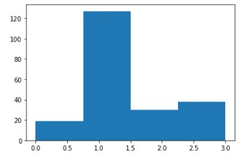

## Link To Solution And Notebooks
* [Question 1 : Analysis of Petrol Formulation](https://github.com/laiky2506/ace_resource/blob/main/README.md#question-1)
  * Link to Notebooks on Azure: [https://example.com](https://example.com)
<br>

* [Question 2 : Influences of External Factors on Fresh Fruit Bunch (FFB) of Oil Palm](https://github.com/laiky2506/ace_resource/blob/main/README.md#question-2)
  * Link to Notebooks on Azure: [https://example.com](https://example.com)
<br>

* [Question 3 : Probability of Word Occurance in Paragraph](https://github.com/laiky2506/ace_resource/blob/main/README.md#question-3)
  * Link to Notebooks on Azure: [https://example.com](https://example.com)

# QUESTION 1
## Task 1a: 
A descriptive analysis of the additives (columns named as “a” to “i”), which must include summaries of findings (parametric/non-parametric). Correlation and ANOVA, if applicable, is a must.

### Introduction
<p> Steps for finding the solution as follow: </p>

1. Import modules
2. Load data into pandas DataFrame
3. Use describe() method to generate a descriptive information of the dataset
4. Run Shapiro-Wilk test to check whether to run a parametric or non parametric test
5. From the test above, non-parametric test should be carried out. Spearman's Rank Correlation is used to do the correlation
6. Kruskal Wallis H Test is carried out as alternative to ANOVA

### Step 1: Modules Used For This Project
```
import pandas as pd
import matplotlib.pyplot as plt
import seaborn as sns
import scipy.stats as stats
from prettytable import PrettyTable
from sklearn.cluster import KMeans
from sklearn.metrics import silhouette_score
```

### STEP 2: Read CSV As DataFrame And Generate Descripive Information Of The Dataset
```
data = pd.read_csv(r"https://docs.google.com/spreadsheets/d/e/2PACX-1vQOdsaFChbSVH7QXsEOLLJNZiL3lr5uFg8ZvBA3tTHKNreaPwZvTA3WQN4LN5f_vYgX_TxkpZKOt0l9/pub?output=csv")
data.describe()
```


### STEP 3: Shapiro–Wilk Test
<p>This test is to determine whether this dataset has a Gaussian distribution.</p>

__Hypothesis__

* H0: the sample has a Gaussian distribution.
* H1: the sample does not have a Gaussian distribution.

```
t = PrettyTable(['column', 'p-value', 'is p-value>0.05?'])

for col in data:
    s, p = stats.shapiro(data[col])
    t.add_row([col, p, p>0.05])

print(t)
```


| column |        p-value         | is p-value>0.05? |
|--------|------------------------|------------------|
|   a    | 1.0766432233591527e-12 |      False       |
|   b    | 3.4656832781365665e-07 |      False       |
|   c    | 2.3908993861355223e-19 |      False       |
|   d    | 2.083195624891232e-07  |      False       |
|   e    | 2.174813440447565e-09  |      False       |
|   f    | 2.1721748481042377e-25 |      False       |
|   g    | 4.2866537515527225e-16 |      False       |
|   h    | 5.383263238128378e-26  |      False       |
|   i    | 1.156668784076633e-20  |      False       |

<p>From the result of the Shapiro–Wilk test, p-value of every data group of the data set is less than 0.05, we have 95% confident that every data group of the set has no Gaussian distribution. Hence, the null hypothesis is rejected and non parametric test should be carried out to perform the analysis.</p>

## STEP 4: Non-parametric Test: Spearman's Rank Correlation Coefficient Matrix

<p>The assumption of normality for Pearson Correlation Test aren't met. Therefore, non parametric alternative, Spearman's Rank Correlation will be carried out. This test is done by comparing every column in the dataset with each other, and determine whether they are independent to each other or not.</p>

__Hypothesis__

* H0: the two samples are independent.
* H1: there is a dependency between the samples.

```
fig, ax = plt.subplots(1,2,figsize=(23, 10))
corrMatrix = data.corr(method='spearman')

p_data = []
for d1 in data.columns:
  p_row = []
  for d2 in data.columns:
    stat, p = stats.spearmanr(data[d1], data[d2])
    p_row.append(round(p,4))
  p_data.append(p_row)

sns.heatmap(corrMatrix, annot=True, cmap=sns.color_palette("coolwarm"), vmin=-1, vmax=1, ax=ax[0])
sns.heatmap(p_data, annot=True, cmap=sns.color_palette("coolwarm"), vmin=0, vmax=0.05, xticklabels=data.columns, yticklabels=data.columns, ax=ax[1])
ax[0].set_title('Spearman Correlation Matrix')
ax[1].set_title('p-value Matrix')
fig.show()
```


<p>From the p-value Matrix (diagram on the right), cells in red colour indicate that the addictive pairs have p-value > 0.05 and failed to rejected the null hypothesis. These pairs are significantly independent. While the rest of pairs are significantly dependent on each other. Most of the pairs in this dataset are significantly dependent on each other.</p>

## STEP 5: Non-parametric Test: Kruskal Wallis H Test

<p>The assumption of normality for ANOVA aren't met. Therefore, non parametric alternative of ANOVA, Kruskal Wallis H Test will be carried out.</p>

- H0: There is no significant difference between the 9 addictives.
- H1: There is significant difference between the 9 addictives.

<p>In order to perform this test, the degrees of freedom for the chi-square (<i>df</i>) need to be determined. The degrees of freedom for the chi-square , df = (r-1)*(c-1), where, </p>

- r = number of row of the dataset
- c = number of column of the dataset 

```
# Determine number of row and column of the data set
r,c = data.shape
# Degree of freedom, df = (r-1)(c-1)
df = (r-1)*(c-1)
print(f"df= {df}")
```

<p> Then, the critical chi-square value at a significant level of 0.05, <i>chi2cric</i> is determined with the method below: </p>

```
chi2cric = stats.chi2.ppf(1-.05, df)
print("chi2cric= %.3f" %(chi2cric))
```

<p>According the calculation aboves:</p>
<p><i>df</i> = 1,704, and <br><i>chi2cric</i> = 1,801.147</p>
<p>Finally, Kruskal Wallis Test was carried out, and the Kruskal-Wallis chi-squared, <i>H</i> = 1707.638</p>

```
H, p = stats.kruskal(data['a'],data['b'],data['c'],data['d'],data['e'],data['f'],data['g'],data['h'],data['i'])
print("H= %.3f" %(H))
```

### CONCLUSION
Kruskal-Wallis chi-squared value, H is smaller than critical chi-squared value, the null hypothesis failed to be rejected. There is __no statistic significant difference__ between the 9 addictives.

## Task 1b: 
A graphical analysis of the additives, including a distribution study.

## Task 1c: 
A clustering test of your choice (unsupervised learning), to determine the distinctive number of formulations present in the dataset.

### Introduction
K-means clustering unsupervised machine learning algorithm has been used to determine the distinctive number of formulation present in the dataset. Steps for finding the solution as follow:

1. Perform K-means clustering n_clusters=1 to n_clusters=20 to determine the distortion of the inertia, and plot them into a elbow curve. Approximate the n_cluster range where the elbow located.
2. With the range determined from above, perform K-means clustering again with n_cluster equal to the range. Silhoutte analysis has been performed on the cluster with n_cluster of the range. 
3. The distinctive number of formulations is equal to the n_cluster with the peak Silhoutte score.

### STEP 1: The Elbow Curve

```
# calculate distortion for a range of number of cluster
distortions = []
for i in range(1, 20):
    km = KMeans(
        n_clusters=i, init='random',
        n_init=10, max_iter=300,
        tol=1e-04, random_state=0
    )
    km.fit(data)
    distortions.append(km.inertia_)

# plot
plt.plot(range(1, 20), distortions, marker='o')
plt.xlabel('Number of clusters')
plt.ylabel('Distortion')
plt.show()
```


### STEP 2: Silhouette Analysis

<p>From the elbow curve above, the elbow is located between k=3 to k=7. Hence, we perform Silhouette analysis with n_cluster=2 to n_cluster=8</p>

```
range_n_clusters = [2, 3, 4, 5, 6, 7, 8]
silhouette_avg = []

for num_clusters in range_n_clusters:
  # initialise kmeans
  kmeans = KMeans(n_clusters=num_clusters)
  kmeans.fit(data)
  cluster_labels = kmeans.labels_
  # silhouette score
  silhouette_avg.append(silhouette_score(data, cluster_labels))

plt.plot(range_n_clusters,silhouette_avg, marker='o')
plt.xlabel("Values of K") 
plt.ylabel("Silhouette score") 
plt.title("Silhouette analysis For Optimal k")
plt.show()
```


### CONCLUSION: 
<p> From the graph above, Silhouette score is maximized at k =3. The distinctive number of formulations is equal to the n_cluster with the peak Silhoutte score which is 3.</p>

<p> The histogram below show the distribution of formulation predicted by K Mean Clustering unsupervised machine learning model with n_cluster=3. </p>



```
km = KMeans(
    n_clusters=3, init='random',
    n_init=10, max_iter=300, 
    tol=1e-04, random_state=0
)
y_km = km.fit_predict(data)
plt.hist(y_km, bins=3)
```

# QUESTION 2
<p>A team of plantation planners are concerned about the yield of oil palm trees, which seems to fluctuate. They have collected a set of data and needed help in analysing on how external factors influence fresh fruit bunch (FFB) yield. Some experts are of opinion that the flowering of oil palm tree determines the FFB yield, and are linked to the external factors. Perform the analysis, which requires some study on the background of oil palm tree physiology.</p>

### INTRODUCTION
<p>After some study on oil palm physiology, I found out that low of season CPO production usually lasts from November until February; the moderate season is usually from March until August and the peak season is either in September or October every year [1]. This shows that month might be a significant feature to be added in the machine learning model. The month data is extracted from the Date column. </p>

<p>Data set is then go through a series of feature engineering including cleaning of data, perform mutual information to select features, remove outlier, one hot encode the category data and standardization. Data provided by the planners as follow:</p>


<p>Four machine learning algorithm, which include linear regression, neural network, random forest regression and XGB regression will be used as prediction model. Additionally, a multi layers sequential deep learning model also used. </p>

### STEP 1: IMPORT MODULES

```
import pandas as pd
import numpy as np
import matplotlib.pyplot as plt
import seaborn as sns
import scipy.stats as stats
from prettytable import PrettyTable
from sklearn.feature_selection import mutual_info_regression
from scipy import optimize
from sklearn.metrics import r2_score,mean_absolute_error,mean_squared_error
import eli5
from eli5.sklearn import PermutationImportance
```

#### Define Global Variable
```
SEED = 1234
```

#### Define custom function
- 
```
# To determine MI score
def make_mi_scores(X, y):
    X = X.copy()
    for colname in X.select_dtypes(["object", "category"]):
        X[colname], _ = X[colname].factorize()
    # All discrete features should now have integer dtypes
    discrete_features = [pd.api.types.is_integer_dtype(t) for t in X.dtypes]
    mi_scores = mutual_info_regression(X, y, discrete_features=discrete_features, random_state=0)
    mi_scores = pd.Series(mi_scores, name="MI Scores", index=X.columns)
    mi_scores = mi_scores.sort_values(ascending=False)
    return mi_scores
```

### STEP 2: LOAD DATASET AS DATAFRAME

```
data = pd.read_csv(r"https://docs.google.com/spreadsheets/d/e/2PACX-1vRAOkG1Ftc9d9y8rSPd6CdPEW4y6UN_6alUf4WWwRsQmn4u6BK-eqKQfSCt6_hpbS1JzmRv-FrWI-MM/pub?output=csv")
data.head()
```


```
data.describe()
```


```
data.info()
```


### STEP 3: Data Cleaning And Features Engineering
It is noticed that the dtype of "Date" column is sting object. Therefore we need to convert it into datetime object. Then we will extract month from this column.

```
data['Date'] = pd.to_datetime(data['Date'],format="%d.%m.%Y")
data['Month'] = data['Date'].dt.month
data['Month']
data.info()
```


Dtype of "Date" converted into datetime and column "Month" is added to the dataset.

### Mutual Information
Since FFB_Yield is the variable that we interested, it is set as label, while the rest of the variables set as features. Then custome function "make_mi_score" is used to determine the mutual information score of every features against the label.

```
X = data[["Month","SoilMoisture","Average_Temp","Min_Temp","Max_Temp","Precipitation","Working_days","HA_Harvested"]]
y = data["FFB_Yield"]
mi_scores = make_mi_scores(X, y)
mi_scores
```

|Feature          |MI Score|
|-----------------|--------|
|Month            |0.529890|
|HA_Harvested     |0.201858|
|Precipitation    |0.127073|
|Min_Temp         |0.078946|
|SoilMoisture     |0.066543|
|Average_Temp     |0.000000|
|Max_Temp         |0.000000|
|Working_days     |0.000000|

<p>The MI score shows that the assumption that month is an important feature is right. From the MI score, it show that "Average_Temp", "Max_Temp" and "Working_days" are not significantly important. </p> 

<p>A correlation test between features and label is then carried out to show the correlation</p>

```
Xy_corr = []
for x in X:
  stat, p = stats.pearsonr(X[x], y)
  Xy_corr.append({'col':x,'stat':stat})
Xy_corr.sort(key=lambda x: x.get('stat'), reverse=True)

for row in Xy_corr:
    print(row['col'],":",round(row['stat'],4))
```
|Feature       |  Corr   |
|--------------|---------|
|Month         | 0.6713  |
|Precipitation | 0.2896  |
|Working_days  | 0.1163  |
|Min_Temp      | 0.1038  |
|SoilMoisture  | -0.0032 |
|Average_Temp  | -0.0055 |
|Max_Temp      | -0.0712 |
|HA_Harvested  | -0.3502 |

And a seaborn regression plot is used to show visualize the linear relationship between features and label.

```
fig, axis = plt.subplots(3,3,figsize=(20, 20))
for i,d in enumerate(X.columns):
  sns.regplot(x=X[d], y=y, ax=axis[int(i/3)][i%3])
```


<p> From the mutial information score and correlation, only column Month, Precipitation, Min_Temp, SoilMoisture and HA_Harvested choosed to be the features for model training and prediction. </p>

### REFERENCE
1. [Rahman, Ayat & Abdullah, Ramli & Nambiappan, Balu & shariff, faizah. (2013). The Impact of La Niña and El Niño Events on Crude Palm Oil Prices: An Econometric Analysis. oil palm industry economic journal (OPIEJ). 13. 38-51.](https://www.researchgate.net/publication/324561855_The_Impact_of_La_Nina_and_El_Nino_Events_on_Crude_Palm_Oil_Prices_An_Econometric_Analysis)
