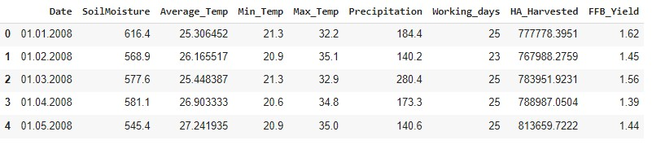

## Link To Solution And Notebooks
* [Question 1 : Analysis of Petrol Formulation](https://github.com/laiky2506/ace_resource/blob/main/README.md#question-1)
  * Link to Notebooks on Azure: [Question_1.ipynb](https://ml.azure.com/fileexplorerAzNB?wsid=/subscriptions/34aea75b-c501-4478-a067-1d3c70b3bb0b/resourcegroups/ANA/workspaces/ANA001&tid=a8750928-46d5-47c4-bc5f-1f402acb8996&activeFilePath=Users/laiky2506/Ace%20Resourse/Question_1.ipynb)
  * Link to Google Colab: [Question_1.ipynb](https://colab.research.google.com/drive/1vuO8xbvHuX6CKy8ztsoIoiSmzEDKhHcA?usp=sharing)
<br>

* [Question 2 : Influences of External Factors on Fresh Fruit Bunch (FFB) of Oil Palm](https://github.com/laiky2506/ace_resource/blob/main/README.md#question-2)
  * Link to Notebooks on Azure: [Question_2.ipynb](https://ml.azure.com/fileexplorerAzNB?wsid=/subscriptions/34aea75b-c501-4478-a067-1d3c70b3bb0b/resourcegroups/ANA/workspaces/ANA001&tid=a8750928-46d5-47c4-bc5f-1f402acb8996&activeFilePath=Users/laiky2506/Ace%20Resourse/Question_2.ipynb)
  * Link to Google Colab: [Question_2.ipynb](https://colab.research.google.com/drive/19hwgBvvqs_tt0XptIWeLy-Gj9ZuKv0Ys?usp=sharing)
<br>

* [Question 3 : Probability of Word Occurance in Paragraph](https://github.com/laiky2506/ace_resource/blob/main/README.md#question-3)
  * Link to Notebooks on Azure: [Question_3.ipynb](https://ml.azure.com/fileexplorerAzNB?wsid=/subscriptions/34aea75b-c501-4478-a067-1d3c70b3bb0b/resourcegroups/ANA/workspaces/ANA001&tid=a8750928-46d5-47c4-bc5f-1f402acb8996&activeFilePath=Users/laiky2506/Ace%20Resourse/Question_3.ipynb)
  * Link to Google Colab: [Question_3.ipynb](https://colab.research.google.com/drive/1e0xyzvIQthnxgXnSOtn3fAcWJYI0UeSa?usp=sharing)

# QUESTION 1
## Task 1a: 
A descriptive analysis of the additives (columns named as “a” to “i”), which must include summaries of findings (parametric/non-parametric). Correlation and ANOVA, if applicable, is a must.

### Introduction
<p> The steps for finding the solution are as follow: </p>

1. Import modules
1. Load data into pandas DataFrame
1. Use describe() method to generate descriptive information about the dataset
1. Run the Shapiro-Wilk test to check whether to run a parametric or non-parametric test
1. From the test above, a non-parametric test should be carried out. Spearman's Rank Correlation is used to do the correlation
1. Kruskal Wallis H Test is carried out as an alternative to ANOVA

### Step 1: Modules Used For This Project
```
import pandas as pd
import matplotlib.pyplot as plt
import seaborn as sns
import scipy.stats as stats
from prettytable import PrettyTable
from sklearn.cluster import KMeans
from sklearn.metrics import silhouette_score
```

### STEP 2: Read CSV As DataFrame And Generate Descripive Information Of The Dataset
```
data = pd.read_csv(r"https://docs.google.com/spreadsheets/d/e/2PACX-1vQOdsaFChbSVH7QXsEOLLJNZiL3lr5uFg8ZvBA3tTHKNreaPwZvTA3WQN4LN5f_vYgX_TxkpZKOt0l9/pub?output=csv")
data.describe()
```


### STEP 3: Shapiro–Wilk Test
<p>This test is to determine whether this dataset has a Gaussian distribution.</p>

__Hypothesis__

* H0: the sample has a Gaussian distribution.
* H1: the sample does not have a Gaussian distribution.

```
t = PrettyTable(['column', 'p-value', 'is p-value>0.05?'])

for col in data:
    s, p = stats.shapiro(data[col])
    t.add_row([col, p, p>0.05])

print(t)
```


| column |        p-value         | is p-value>0.05? |
|--------|------------------------|------------------|
|   a    | 1.0766432233591527e-12 |      False       |
|   b    | 3.4656832781365665e-07 |      False       |
|   c    | 2.3908993861355223e-19 |      False       |
|   d    | 2.083195624891232e-07  |      False       |
|   e    | 2.174813440447565e-09  |      False       |
|   f    | 2.1721748481042377e-25 |      False       |
|   g    | 4.2866537515527225e-16 |      False       |
|   h    | 5.383263238128378e-26  |      False       |
|   i    | 1.156668784076633e-20  |      False       |

<p>From the result of the Shapiro–Wilk test, the p-value of every data group of the data set is less than 0.05, we have 95% confidence that every data group of the set has no Gaussian distribution. Hence, the null hypothesis is rejected and non-parametric test should be carried out to perform the analysis.</p>

## STEP 4: Non-parametric Test: Spearman's Rank Correlation Coefficient Matrix

<p>The assumption of normality for the Pearson Correlation Test isn't met. Therefore, a non-parametric alternative, Spearman's Rank Correlation will be carried out. This test is done by comparing every column in the dataset with each other, and determining whether they are independent of each other or not.</p>

__Hypothesis__

* H0: the two samples are independent.
* H1: there is a dependency between the samples.

```
fig, ax = plt.subplots(1,2,figsize=(23, 10))
corrMatrix = data.corr(method='spearman')

p_data = []
for d1 in data.columns:
  p_row = []
  for d2 in data.columns:
    stat, p = stats.spearmanr(data[d1], data[d2])
    p_row.append(round(p,4))
  p_data.append(p_row)

sns.heatmap(corrMatrix, annot=True, cmap=sns.color_palette("coolwarm"), vmin=-1, vmax=1, ax=ax[0])
sns.heatmap(p_data, annot=True, cmap=sns.color_palette("coolwarm"), vmin=0, vmax=0.05, xticklabels=data.columns, yticklabels=data.columns, ax=ax[1])
ax[0].set_title('Spearman Correlation Matrix')
ax[1].set_title('p-value Matrix')
fig.show()
```


<p>From the p-value Matrix (diagram on the right), cells in red colour indicate that the addictive pairs have a p-value > 0.05 and failed to reject the null hypothesis. These pairs are significantly independent. While the rest of the pairs are significantly dependent on each other. Most of the pairs in this dataset are significantly dependent on each other.</p>

## STEP 5: Non-parametric Test: Kruskal Wallis H Test

<p>The assumption of normality for ANOVA isn't met. Therefore, the non-parametric alternative of ANOVA, Kruskal Wallis H Test will be carried out.</p>

- H0: There is no significant difference between the 9 addictives.
- H1: There is significant difference between the 9 addictives.

<p>To perform this test, the degrees of freedom for the chi-square (df) need to be determined. The degrees of freedom for the chi-square, df = (r-1)*(c-1), where,</p>

- r = number of row of the dataset
- c = number of column of the dataset 

```
# Determine number of row and column of the data set
r,c = data.shape
# Degree of freedom, df = (r-1)(c-1)
df = (r-1)*(c-1)
print(f"df= {df}")
```

<p> Then, the critical chi-square value at a significant level of 0.05, <i>chi2cric</i> is determined with the method below: </p>

```
chi2cric = stats.chi2.ppf(1-.05, df)
print("chi2cric= %.3f" %(chi2cric))
```

<p>According to the calculation above:</p>
<p><i>df</i> = 1,704, and <br><i>chi2cric</i> = 1,801.147</p>
<p>Finally, Kruskal Wallis Test was carried out, and the Kruskal-Wallis chi-squared, <i>H</i> = 1707.638</p>

```
H, p = stats.kruskal(data['a'],data['b'],data['c'],data['d'],data['e'],data['f'],data['g'],data['h'],data['i'])
print("H= %.3f" %(H))
```

### CONCLUSION
Kruskal-Wallis chi-squared value, H is smaller than the critical chi-squared value, and the null hypothesis failed to be rejected. There is __no statistically significant difference__ between the 9 addictives.

## Task 1b: 
A graphical analysis of the additives, including a distribution study.

### INTRODUCTION
Three graphs are plotted for graphical analysis: histogram, boxplot and scatter diagrams

```
fig, axis = plt.subplots(3,3,figsize=(12, 12))
for i,avg in enumerate(data.mean()):
  axis[int(i/3)][i%3].axvline(avg, color='r', linestyle='solid', linewidth=2)
data.hist(ax=axis, bins = 50)
```
```
fig, axis = plt.subplots(3,3,figsize=(24, 12))
for i,col in enumerate(data):
	sns.boxplot(x=data[col], ax=axis[int(i/3)][i%3],labels=col)
```

```
fig, axis = plt.subplots(len(data.columns),len(data.columns),figsize=(20, 20))
for i,d1 in enumerate(data.columns):
  for j,d2 in enumerate(data.columns):
    sns.regplot(x=data[d1], y=data[d2], ax=axis[i][j])
```


<p><b>Histogram</b><br>From the histogram above, columns a,b,e,d & g have a normal distribution while the rest does not.</p>


<p><b>Boxplot</b><br>From the boxplot above, other than column c, all other columns have a significant amount of outliers. Colum f,h & i are having too much 0-value until the plot is heavily skewed to the left.</p>


<p><b>Regression Plot (Scatter Plot)</b><br>From the regression plot above, most of the pairs do not show any clear correlation. All the points do not fit well into the regression line.</p>

### CONCLUSION
From the graphical analysis, the data doesn't show any clear relationship among each other.

## Task 1c: 
A clustering test of your choice (unsupervised learning), to determine the distinctive number of formulations present in the dataset.

### Introduction
K-means clustering unsupervised machine learning algorithm has been used to determine the distinctive number of formulations present in the dataset. The steps for finding the solution are as follow:

1. Perform K-means clustering n_clusters=1 to n_clusters=20 to determine the distortion of the inertia, and plot them into an elbow curve. Approximate the n_cluster range where the elbow is located.
2. With the range determined from above, perform K-means clustering again with n_cluster equal to the range. Silhouette analysis has been performed on the cluster with n_cluster of the range. 
3. The distinctive number of formulations is equal to the n_cluster with the peak Silhouette score.

### STEP 1: The Elbow Curve

```
# calculate distortion for a range of number of cluster
distortions = []
for i in range(1, 20):
    km = KMeans(
        n_clusters=i, init='random',
        n_init=10, max_iter=300,
        tol=1e-04, random_state=0
    )
    km.fit(data)
    distortions.append(km.inertia_)

# plot
plt.plot(range(1, 20), distortions, marker='o')
plt.xlabel('Number of clusters')
plt.ylabel('Distortion')
plt.show()
```


### STEP 2: Silhouette Analysis

<p>From the elbow curve above, the elbow is located between k=3 to k=7. Hence, we perform Silhouette analysis with n_cluster=2 to n_cluster=8</p>

```
range_n_clusters = [2, 3, 4, 5, 6, 7, 8]
silhouette_avg = []

for num_clusters in range_n_clusters:
  # initialise kmeans
  kmeans = KMeans(n_clusters=num_clusters)
  kmeans.fit(data)
  cluster_labels = kmeans.labels_
  # silhouette score
  silhouette_avg.append(silhouette_score(data, cluster_labels))

plt.plot(range_n_clusters,silhouette_avg, marker='o')
plt.xlabel("Values of K") 
plt.ylabel("Silhouette score") 
plt.title("Silhouette analysis For Optimal k")
plt.show()
```


### CONCLUSION: 
<p>From the graph above, the Silhouette score is maximized at k =3. The distinctive number of formulations is equal to the n_cluster with the peak Silhouette score which is 3.</p>

<p>The histogram below shows the distribution of formulation predicted by K Mean Clustering unsupervised machine learning model with n_cluster=3.</p>


```
km = KMeans(
    n_clusters=3, init='random',
    n_init=10, max_iter=300, 
    tol=1e-04, random_state=0
)
y_km = km.fit_predict(data)
plt.hist(y_km, bins=3)
```

# QUESTION 2
<p>A team of plantation planners are concerned about the yield of oil palm trees, which seems to fluctuate. They have collected a set of data and needed help in analysing on how external factors influence fresh fruit bunch (FFB) yield. Some experts are of opinion that the flowering of oil palm tree determines the FFB yield, and are linked to the external factors. Perform the analysis, which requires some study on the background of oil palm tree physiology.</p>

### INTRODUCTION
<p>After some study on oil palm physiology, I found out that low of season CPO production usually lasts from November until February; the moderate season is usually from March until August and the peak season is either in September or October every year [<a href='https://github.com/laiky2506/ace_resource#reference'>1</a>]. This shows that month might be a significant feature to be added to the machine learning model. The "month" data is extracted from the Date column. </p>

<p>Data set then go through a series of feature engineering including cleaning of data, perform mutual information to select features, remove outlier, one hot encode the category data and standardization. Data provided by the planners is as follow:</p>


<p>Four machine learning algorithms, which include linear regression, neural network, random forest regression and XGB regression will be used as a prediction model. Additionally, a multi-layers sequential deep learning model was also used. </p>

### STEP 1: IMPORT MODULES

```
import pandas as pd
import numpy as np
import matplotlib.pyplot as plt
import seaborn as sns
import scipy.stats as stats
from prettytable import PrettyTable
from sklearn.feature_selection import mutual_info_regression
from scipy import optimize
from sklearn.metrics import r2_score,mean_absolute_error,mean_squared_error
import eli5
from eli5.sklearn import PermutationImportance
```

#### Define Global Variable
```
SEED = 1234
```

#### Define custom function
- 
```
# To determine MI score
def make_mi_scores(X, y):
    X = X.copy()
    for colname in X.select_dtypes(["object", "category"]):
        X[colname], _ = X[colname].factorize()
    # All discrete features should now have integer dtypes
    discrete_features = [pd.api.types.is_integer_dtype(t) for t in X.dtypes]
    mi_scores = mutual_info_regression(X, y, discrete_features=discrete_features, random_state=0)
    mi_scores = pd.Series(mi_scores, name="MI Scores", index=X.columns)
    mi_scores = mi_scores.sort_values(ascending=False)
    return mi_scores
```

### STEP 2: LOAD DATASET AS DATAFRAME

```
data = pd.read_csv(r"https://docs.google.com/spreadsheets/d/e/2PACX-1vRAOkG1Ftc9d9y8rSPd6CdPEW4y6UN_6alUf4WWwRsQmn4u6BK-eqKQfSCt6_hpbS1JzmRv-FrWI-MM/pub?output=csv")
data.head()
```



```
data.describe()
```


```
data.info()
```


### STEP 3: Data Cleaning And Features Engineering
It is noticed that the dtype of the "Date" column is a string object. Therefore we need to convert it into a DateTime object. Then we will extract the month from this column.

```
data['Date'] = pd.to_datetime(data['Date'],format="%d.%m.%Y")
data['Month'] = data['Date'].dt.month
data['Month']
data.info()
```


Dtype of "Date" is converted into DateTime and column "Month" is added to the dataset.

### Mutual Information
Since FFB_Yield is the variable that we are interested in, it is set as the label, while the rest of the variables are set as features. Then custom function "make_mi_score" is used to determine the mutual information score of every feature against the label.

```
X = data[["Month","SoilMoisture","Average_Temp","Min_Temp","Max_Temp","Precipitation","Working_days","HA_Harvested"]]
y = data["FFB_Yield"]
mi_scores = make_mi_scores(X, y)
mi_scores
```

|Feature          |MI Score|
|-----------------|--------|
|Month            |0.529890|
|HA_Harvested     |0.201858|
|Precipitation    |0.127073|
|Min_Temp         |0.078946|
|SoilMoisture     |0.066543|
|Average_Temp     |0.000000|
|Max_Temp         |0.000000|
|Working_days     |0.000000|

<p>The MI score shows that the assumption that month is an important feature is right. From the MI score, it shows that "Average_Temp", "Max_Temp" and "Working_days" are not significantly important. </p> 

<p>A correlation test between features and the label is then carried out to show the correlation</p>

```
Xy_corr = []
for x in X:
  stat, p = stats.pearsonr(X[x], y)
  Xy_corr.append({'col':x,'stat':stat})
Xy_corr.sort(key=lambda x: x.get('stat'), reverse=True)

for row in Xy_corr:
    print(row['col'],":",round(row['stat'],4))
```
|Feature       |  Corr   |
|--------------|---------|
|Month         | 0.6713  |
|Precipitation | 0.2896  |
|Working_days  | 0.1163  |
|Min_Temp      | 0.1038  |
|SoilMoisture  | -0.0032 |
|Average_Temp  | -0.0055 |
|Max_Temp      | -0.0712 |
|HA_Harvested  | -0.3502 |

And a seaborn regression plot is used to show visualize the linear relationship between features and the label.

```
fig, axis = plt.subplots(3,3,figsize=(20, 20))
for i,d in enumerate(X.columns):
  sns.regplot(x=X[d], y=y, ax=axis[int(i/3)][i%3])
```


<p> From the mutual information score and correlation, only columns Month, Precipitation, Min_Temp, SoilMoisture and HA_Harvested were chosen to be the features and FFB_Yield is the label for model training and prediction. </p>

```
features = data[["Month","Precipitation","Min_Temp","SoilMoisture","HA_Harvested","FFB_Yield"]]
```

<p> Then we detect and remove the outliers. Outliers are defined as values larger or smaller than the mean by 3 times standard deviation</p>

```
print(features.shape)
for f in features:
    outlier = detect_outlier(features[f])
    for o in outlier:
        features = features.drop(features[features[f] == o].index)

print(features.shape)
```

<p>The shape of the features+label reduced from (130, 6) to (125, 6), and 5 outliers are detected and removed. And FFB_Yield is separated from the features data frame and store as label data frame.</p>

```
label = features.pop("FFB_Yield")
```

<p>The data split into train and test data with a test size of 0.2, then the X_train and X_test standardize according to X_train data.</p>

```
from sklearn.model_selection import train_test_split
X_train, X_test, y_train, y_test = train_test_split(np.array(features), np.array(label), test_size = 0.2, random_state = SEED)
```

```
import sklearn.preprocessing as preprocessing

standardizer = preprocessing.StandardScaler()
standardizer.fit(X_train)
X_train = standardizer.transform(X_train)
X_test = standardizer.transform(X_test)
```

<p> The train data then used to trained the models. </p>
<p> The training data is then used to train the models. </p>

### STEP 4: Train Machine Learning Model and Perform Evaluation
<p> The training data is used to train 5 different machine learning and/or deep learning model including linear regression, random forest regressor, XGB regressor, neural network and multi-layer Keras sequential model. FFB_Yield prediction, y_pred is predicted using the trained model, and then cross-validate with y_test data. The result of the evaluation is as follow: </p>

| Model:   | Linear Regression | Random Forest | XGB Regressor | Neural Network | Keras Sequential |
|----------|-------------------|---------------|---------------|----------------|------------------|
|R2 Score: |0.3218             |0.6028         |0.5250         |0.0825          |-0.5325           |
|MAE     : |0.1644             |0.1137         |0.1394         |0.1936          |0.2037            |
|MSE     : |0.0394             |0.0230         |0.0275         |0.0531          |0.0888            |
|RMSE    : |0.1982             |0.1517         |0.1659         |0.2305          |0.2980            |

<p> Permutation Importance of every trained model is shown as follow: </p>


<b> SHAP value for Keras Sequential</b>


<p>NOTE: Please refer to the notebooks for the detail of the machine learning code.</p>

### CONCLUSION
<p> Random forest regressor is the best machine learning model to be used for this data set. However, the R2 score of the model is only 0.6 which consider not too high. Neural networks and deep learning not working well due to insufficient data. From the permutation importance, harvested area, precipitation, soil moisture and month do significantly impact the FFB. According to a domain study, oil palm can only grow well at places with a maximum temperature range of 29–33℃ and a minimum temperature range of 22–24℃ minimum [<a href='https://github.com/laiky2506/ace_resource#reference'>2</a>]. However, the temperature seems to be not important in these machine learning models. This is mainly due to not many changes in temperature throughout the year in tropical countries such as Malaysia and Indonesia.  </p> 

<p> According to the permutation importance, whether or not the data is from September and October heavily impacts the output of the models, which matches the assumption in the introduction section. </p>

<p> To improve the model performance, more data needed to be collected. "Working_days" data is completely useless in this case, information like man-hours which can represent total work done during the month should be recorded instead of working_days. </p>

# QUESTION 3

### INTRODUCTION

```
As a term, data analytics predominantly refers to an assortment of applications, from basic business
intelligence (BI), reporting and online analytical processing (OLAP) to various forms of advanced
analytics. In that sense, it's similar in nature to business analytics, another umbrella term for
approaches to analyzing data -- with the difference that the latter is oriented to business uses, while
data analytics has a broader focus. The expansive view of the term isn't universal, though: In some
cases, people use data analytics specifically to mean advanced analytics, treating BI as a separate
category. Data analytics initiatives can help businesses increase revenues, improve operational
efficiency, optimize marketing campaigns and customer service efforts, respond more quickly to
emerging market trends and gain a competitive edge over rivals -- all with the ultimate goal of
boosting business performance. Depending on the particular application, the data that's analyzed
can consist of either historical records or new information that has been processed for real-time
analytics uses. In addition, it can come from a mix of internal systems and external data sources. At
a high level, data analytics methodologies include exploratory data analysis (EDA), which aims to find
patterns and relationships in data, and confirmatory data analysis (CDA), which applies statistical
techniques to determine whether hypotheses about a data set are true or false. EDA is often
compared to detective work, while CDA is akin to the work of a judge or jury during a court trial -- a
distinction first drawn by statistician John W. Tukey in his 1977 book Exploratory Data Analysis. Data
analytics can also be separated into quantitative data analysis and qualitative data analysis. The
former involves analysis of numerical data with quantifiable variables that can be compared or
measured statistically. The qualitative approach is more interpretive -- it focuses on understanding
the content of non-numerical data like text, images, audio and video, including common phrases,
themes and points of view.
```
<p> Given the above paragraph, the solution to the question below is answered using Python and the regEx module. </p>

1. What is the probability of the word “data” occurring in each line ?
1. What is the distribution of distinct word counts across all the lines ?
1. What is the probability of the word “analytics” occurring after the word “data” ?

For the purpose of machine learning for NLP, tf-idf score will be calculated. Although in NLP, tf-idf score is more useful for machine learning purpose, it should not be confused with probability.

### STEP 1: Import Modules And Store Data Into List

```
import re
from beautifultable import BeautifulTable
import requests
import matplotlib.pyplot as plt
import seaborn as sns
```

```
response = requests.get("https://www.pastebin.com/raw/ZYRyXREP")
lines = response.text.split("\n")
print(lines)
```

<p>
The list is named as lines, and storing the following data:
<br><br>
['As a term, data analytics predominantly refers to an assortment of applications, from basic business\r', 'intelligence (BI), reporting and online analytical processing (OLAP) to various forms of advanced\r', "analytics. In that sense, it's similar in nature to business analytics, another umbrella term for\r", 'approaches to analyzing data -- with the difference that the latter is oriented to business uses, while\r', "data analytics has a broader focus. The expansive view of the term isn't universal, though: In some\r", 'cases, people use data analytics specifically to mean advanced analytics, treating BI as a separate\r', 'category. Data analytics initiatives can help businesses increase revenues, improve operational\r', 'efficiency, optimize marketing campaigns and customer service efforts, respond more quickly to\r', 'emerging market trends and gain a competitive edge over rivals -- all with the ultimate goal of\r', "boosting business performance. Depending on the particular application, the data that's analyzed\r", 'can consist of either historical records or new information that has been processed for real-time\r', 'analytics uses. In addition, it can come from a mix of internal systems and external data sources. At\r', 'a high level, data analytics methodologies include exploratory data analysis (EDA), which aims to find\r', 'patterns and relationships in data, and confirmatory data analysis (CDA), which applies statistical\r', 'techniques to determine whether hypotheses about a data set are true or false. EDA is often\r', 'compared to detective work, while CDA is akin to the work of a judge or jury during a court trial -- a\r', 'distinction first drawn by statistician John W. Tukey in his 1977 book Exploratory Data Analysis. Data\r', 'analytics can also be separated into quantitative data analysis and qualitative data analysis. The\r', 'former involves analysis of numerical data with quantifiable variables that can be compared or\r', 'measured statistically. The qualitative approach is more interpretive -- it focuses on understanding\r', 'the content of non-numerical data like text, images, audio and video, including common phrases,\r', 'themes and points of view.']
</p>

STEP 2: 
Count the number of words, the number of distinct words, and the occurrence of the word "data", then calculate the probability of the word "data" occurring in each line (Also know as TF).

```
table = BeautifulTable()
table.columns.header = ["line","Total Word Count", "Distinct Word Count", "Occurance of “data”", "Term Frequency"]
distinct_count = []
for i,line in enumerate(lines):
    lines[i] = line.strip()
    line = lines[i].lower()
    count_all = re.findall("[\w|\d]+",line)
    data_find = re.findall("\Wdata\W",line.lower())
    data_analytics_find = re.findall("\Wdata\Wanalytics\W",line)
    new_list = list(dict.fromkeys(re.findall("[\w|\d]+",line)))
    distinct_count.append(len(new_list))
    table.rows.append([i+1,len(count_all),len(new_list),len(data_find),round(len(data_find)/len(count_all),3)])
print(table)
```


| line | Total Word Count | Distinct Word Count | Occurrence of “data”  | Term Frequency |
|------|------------------|---------------------|-----------------------|----------------|
|  1   |           15     |             15      |             1         | 0.067          |
|  2   |           13     |             13      |             0         | 0.0            |
|  3   |           16     |             14      |             0         | 0.0            |
|  4   |           16     |             14      |             1         | 0.062          |
|  5   |           18     |             17      |             0         | 0.0            |
|  6   |           15     |             14      |             1         | 0.067          |
|  7   |           11     |             11      |             1         |0.091           |
|  8   |           12     |             12      |             0         |0.0             |
|  9   |           16     |             16      |             0         |0.0             |
|  10  |           13     |             12      |             1         |0.077           |
|  11  |           16     |             16      |             0         |0.0             |
|  12  |           18     |             18      |             1         |0.056           |
|  13  |           15     |             14      |             2         |0.133           |
|  14  |           13     |             11      |             2         |0.154           |
|  15  |           16     |             16      |             1         |0.062           |
|  16  |           21     |             17      |             0         |0.0             |
|  17  |           16     |             15      |             1         |0.062           |
|  18  |           14     |             12      |             2         |0.143           |
|  19  |           14     |             14      |             1         | 0.071          |
|  20  |           12     |             12      |             0         |0.0             |
|  21  |           15     |             15      |             1         |0.067           |
|  22  |           5      |             5       |             0         |0.0             |

<p>And the distribution is shown as follow</p>

```
fig, ax = plt.subplots(2,1,figsize=(10,10))
sns.histplot(distinct_count, bins=24, ax=ax[0])
sns.kdeplot(distinct_count, ax=ax[1])
```


### STEP 3: Calculate The Probability Of analytics Occurance After The Word data
<p>The probability P can easily be calculated using the number of the word "data analytics" occurred in the paragraph divided by number of the word "data" occurred in the paragraph</p>

The lines are joined to for a full paragraph without linebreak.

```
text = ' '.join(lines)
print(text)
```

The calculation is done by simple arithmetic operation as follow:

```
data_count = len(re.findall("\Wdata\W",text))
data_analytics_count = len(re.findall("\Wdata\Wanalytics\W",text))
P = data_analytics_count/data_count
print(f"Probability of the word “analytics” occurring after the word “data”, P= data_analytics_count/data_count = {data_analytics_count}/{data_count} = {P}")
```

Probability of the word “analytics” occurring after the word “data”, P= data_analytics_count/data_count = 4/15 = 0.26666666666666666

### Extra: TF-IDF Score Of "data" In Each Line

```
from sklearn.feature_extraction.text import TfidfVectorizer
import pandas as pd
cv = TfidfVectorizer()
X = cv.fit_transform(lines)
idf = X.toarray()
words_set = cv.get_feature_names()

tf_idf = pd.DataFrame(idf, columns = words_set)
print(tf_idf['data'])
```
|line  | TF-IDF |
|------|--------|
|0     |0.023922|
|1     |0.000000|
|2     |0.000000|
|3     |0.000000|
|4     |0.020008|
|5     |0.042228|
|6     |0.026081|
|7     |0.000000|
|8     |0.000000|
|9     |0.000000|
|10    |0.000000|
|11    |0.019166|
|12    |0.046296|
|13    |0.000000|
|14    |0.000000|
|15    |0.000000|
|16    |0.000000|
|17    |0.049086|
|18    |0.000000|
|19    |0.000000|
|20    |0.000000|
|21    |0.000000|

# REFERENCE
1. [Rahman, Ayat & Abdullah, Ramli & Nambiappan, Balu & shariff, faizah. (2013). The Impact of La Niña and El Niño Events on Crude Palm Oil Prices: An Econometric Analysis. oil palm industry economic journal (OPIEJ). 13. 38-51.](https://www.researchgate.net/publication/324561855_The_Impact_of_La_Nina_and_El_Nino_Events_on_Crude_Palm_Oil_Prices_An_Econometric_Analysis)
2. [Ahmed, A.; Yusoff Ishak, M.; Kamal Uddin, M.; Yusoff Abd Samad, M.; Mukhtar, S.; Shehu Danhassan, S. Effects of Some Weather Parameters on Oil Palm Production in the Peninsular Malaysia. Preprints 2021, 2021060456.](https://www.preprints.org/manuscript/202106.0456/v1)
